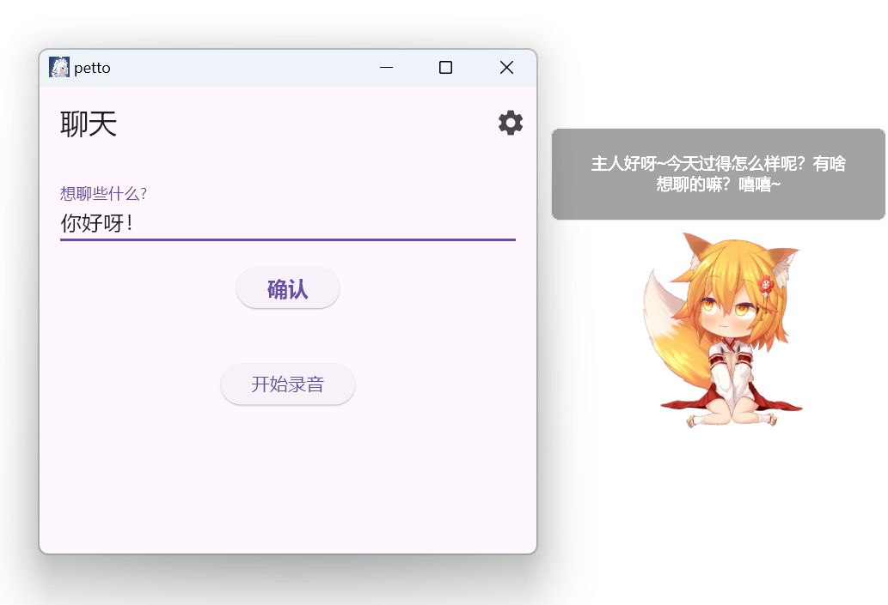
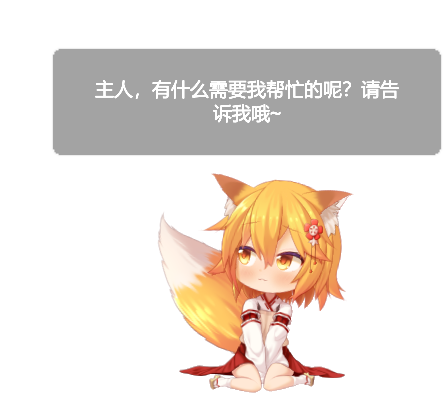

# Petto

一款Live2D智能桌面助手。

[English](README.md) · [简体中文](README_zh.md)

## 1. 概述
Petto会定时输出名言/情境问候/时间问候，支持流式/Whisper语音识别、TTS语音合成、动作触发表情管理等。自v3.0.0起默认使用全新的Kage模式；原Live2DViewerEX ExAPI工作流保留为"兼容模式"。

## 2. v3.0.0版本更新
v3.0.0是一个重大更新版本，包含代码重构、新增Kage默认模式、跨平台改进等多项变更。

**查看完整更新日志**：[CHANGELOG_v3.0.0.md](CHANGELOG_v3.0.0.md)

## 3. 模式选择
| 模式 | 状态 | 文档 |
| ---- | ---- | ---- |
| Kage | 推荐 | [docs/MODE_KAGE_zh.md](docs/MODE_KAGE_zh.md) |
| Live2DViewerEX兼容 | 支持 | [docs/MODE_LIVE2DVIEWEREX_zh.md](docs/MODE_LIVE2DVIEWEREX_zh.md) |

## 4. 快速开始
1. 下载最新Release并解压
2. 直接运行`petto`
3. 首次启动若未找到Kage，会检测并提示下载
4. 在设置中确认WebSocket地址(默认`ws://localhost:23333`)，可选择模型JSON
5. 点击动作分组刷新按钮自动获取motions
6. 开始对话或启用流式识别

### 使用Live2DViewerEX兼容模式
设置→切换为兼容模式→填写ExAPI地址和模型序号。详见[MODE_LIVE2DVIEWEREX_zh.md](docs/MODE_LIVE2DVIEWEREX_zh.md)。

## 5. 主要功能
* 情境问候(基于天气/时间/当前窗口截图)
* 语音交互：
  * 流式MASR兼容识别
  * Whisper识别(OpenAI兼容)
* 后台关键词唤醒
* TTS语音播放(OpenAI兼容，提供演示端点)
* 快捷键唤醒
* Kage模式下自动获取动作列表
* 可选的窗口截图
* 更新检查与日志开关

## 6. 设置项详细说明

你可以在主界面右上角的设置中详细配置Petto功能。

### 桌宠模式
- **Kage(默认)**：现代化的WebSocket接口，自动下载，支持动作/表情/文本管理
  - 详细配置说明请查看[MODE_KAGE_zh.md](docs/MODE_KAGE_zh.md)
- **Live2DViewerEX兼容**：保留对旧版本的支持，需要手动配置
  - 详细配置说明请查看[MODE_LIVE2DVIEWEREX_zh.md](docs/MODE_LIVE2DVIEWEREX_zh.md)

### 语言模型(LLM)设置

> Petto支持符合OpenAI格式的语言模型API。

Petto默认配置了一个公用的语言模型：[https://free-llm.cupsfunny.com/v1](https://free-llm.cupsfunny.com/v1)，里面包含了一些可以直接使用的模型。

Key为sk-ObgTAfL0qYK6OmoYpQx2qra3EyIxdtP2DPAzz8D5wwe3Eb9l。

注：该公益服务可能会不定期更换Key或关闭，请勿滥用。

### 角色设置

> 你可以自己设置角色的名字、设定、称呼等信息。

根据你正在使用的桌宠角色来编写符合你期望的角色设定吧！

### 消息示例

> LLM的回复将会受到消息示例的影响。

该设置用于给模型提供参考。如果你觉得LLM的回应不符合你的预期，你可以试着编写一段简单的消息示例传递给LLM。

### 流式语音识别

> 如果识别地址留空，将使用Whisper识别模式。

> 后台识别服务会一直保持录音状态，并将语音内容回传至设置的识别地址。请注意潜在的隐私安全问题。

目前，流式识别必须使用兼容[MASR](https://github.com/yeyupiaoling/MASR)的服务端识别项目的接口。

项目默认配置了一个公用的流式识别：wss://api.cups.moe/api/asr/

服务器性能一般，请轻拿轻放 :) 用得太猛我服务器可能会崩。

建议参考后文的教程自行部署MASR服务，或者使用Whisper模式。

启用后台流式识别后，Petto在后台会一直运行流式识别功能。当检测到任何一个包含后台唤醒关键词的语音时，桌宠会向你发送消息并示意你与它对话：
> 用户：帮帮我
>
> 桌宠：主人，有什么需要我帮忙的呢？请告诉我哦~

随后，Petto会自动地开启十秒钟的录音识别，你可以与桌宠交流，录音识别结束后，桌宠将给出回复。

### Whisper识别模式

> 与流式识别不同。Whisper识别模式必须先完整录音才能得到最后的文本，这主要影响后台识别的速度。
>
> Petto支持符合OpenAI用法的Whisper API。

### 一言API地址

> 如果没有特殊情况，保持默认值即可。

填写请求一言的API地址。

### TTS

> Petto支持符合OpenAI用法的TTS API。

虽然默认不会填入TTS信息，但我们实际上也提供了一个即开即用的TTS服务：

TTS地址：[https://api.cups.moe/api/tts/](https://api.cups.moe/api/tts/)

TTS Key: ecWdn$TJ&ktP#89

该服务基于[openai-edge-tts](https://github.com/travisvn/openai-edge-tts)部署

### 快捷键

设置唤醒Petto的快捷键。录制后保存即可生效。

### 窗口截图

> 该功能用于获取当前活动窗口的截图作为上下文信息。默认关闭。

若在设置中启用截图模式作为上下文：
* Petto会将当前活动窗口截图传递给语言模型，用于生成更贴近上下文的问候文本
* 请注意潜在的隐私安全问题

**跨平台支持：**

v3.0.0使用[xcap](https://github.com/nashaofu/xcap)进行跨平台截图，支持Windows、macOS和Linux。

**注意：** v3.0.0已移除旧版本的"窗口标题"功能，现统一使用窗口截图。

### 文本显示时长

设置桌宠文本气泡的显示时间，单位为毫秒。

默认：`3000`(3秒)

* 适用于Kage模式和Live2DViewerEX兼容模式
* 控制问候语、回复消息等文本的显示时长

## 7. 开机启动

* (可选)在设置中，勾选"启动时隐藏窗口"
* 按Win+R键，输入shell:startup。创建一个petto.exe的快捷方式并放入该文件夹中

## 8. 本地部署MASR语音识别服务

> 下文提供的模型仅训练了中文语料。你可以手动训练支持更多语言、准确率更高的模型；或者使用预训练好的模型或Whisper接口进行语音识别。

* 下载[inference.pt](https://www.cups.moe/static/asr/inference.pt)用于本地部署。
* 下载[model.pdiparams](https://www.cups.moe/static/asr/model.pdiparams)为识别结果添加标点符号。

## 9. 语音模式说明
流式：实时传输，响应快。
Whisper：先录音后识别。留空流式地址将使用Whisper。
使用语音识别请注意隐私风险。

## 10. Roadmap / TODO
- [ ] 支持更多语言
- [ ] 语音认证
- [ ] UI优化
- [x] macOS支持
- [x] Linux支持
- [x] Kage集成

## 11. 常见问题
| 问题 | 排查建议 |
| ---- | -------- |
| Kage无法连接 | 检查ws地址/防火墙/端口占用 |
| 动作列表为空 | 模型JSON是否正确；刷新；查看日志 |
| 文本不显示 | 文本显示时长>0；版本是否最新 |
| 流式卡顿 | 自建MASR或切Whisper |
| 兼容模式无动作 | 动作分组是否填写正确 |
| Kage未自动检测 | 手动选择可执行文件后重启 |

## 12. 贡献
欢迎PR与Issue。

## 13. 许可证
GPL-3.0-or-later，详见LICENSE。

## 14. 赞助
由NETJETT赞助: https://netjett.com/aff.php?aff=45

---

需要更详细的模式说明？请阅读：[docs/MODE_KAGE_zh.md](docs/MODE_KAGE_zh.md)与[docs/MODE_LIVE2DVIEWEREX_zh.md](docs/MODE_LIVE2DVIEWEREX_zh.md)。