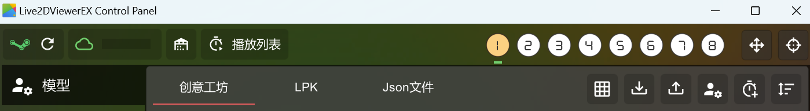

# Petto

**Read this in other languages: [English](README.md), [简体中文](README_zh.md)**

Petto是一款基于Live2DViewerEX的智能桌面助手。支持流式语音识别、自然语言和语音对话等功能

使用它来点缀你的桌宠吧！

## 功能

每隔一定时间，桌宠将：
* 输出名人名言
* 根据当前天气气候、季节，以及你正在访问的窗口等信息，通过大语言模型输出问候语
* 根据当前时间，输出简单问候

此外，Petto还支持流式语音识别、TTS语音转文本、后台唤醒等功能，可以与桌宠进行语音交流！


## 支持的语言

* 英语
* 简体中文

## 开始使用

* 下载Petto的Release包
* 解压到电脑的任意一个地方
* 确保你的Live2DViewerEX已经运行，然后打开解压后的petto.exe
* Done! 试试和你的桌宠对话吧！

## 进阶使用

### 设置项

你可以在主界面右上角的设置中详细配置Petto功能。

下面给出部分设置项的说明

#### 语言模型(LLM)设置

> Petto支持符合OpenAI用法的语言模型API。

Petto默认配置了一个公用的语言模型：[https://api.cups.moe/api/chat](https://api.cups.moe/api/chat)
，该模型基于[Duck2api](https://github.com/aurora-develop/Duck2api)项目部署。

不过由于Duckduckgo官方限制，该模型短期内请求次数过多会暂时无法响应。请考虑使用自己的API或在本机上自行部署语言模型。

#### 角色设置

> 你可以自己设置角色的名字、设定、称呼等信息。

根据你正在使用的桌宠角色来编写符合你期望的角色设定吧！

#### 消息示例

> LLM的回复将会受到消息示例的影响。

该设置用于给模型提供参考。如果你觉得LLM的回应不符合你的预期，你可以试着编写一段简单的消息示例传递给LLM。

#### ExAPI地址

> 如果没有特殊情况，保持默认值即可。

必填项目，用于与Live2DViewerEX进行通信。

#### Live2d模型序号

必填项目，用于指定Petto使用的Live2D模型序号。其值为(Live2DViewerEX中显示的模型编号-1)。例如，在下图的情况下选择的模型，其序号为0。



#### 预执行模型指令

该指令可以用于在本机上启动语言模型和语音识别模型。

Petto已经提供了参考用的startmodel.ps1和startserver.ps1，可以在本机上启动RWKV模型和基于MASR的语音识别模型。后文将提供更详细的信息。

Petto允许这两个脚本输出一个pid用于管理该进程。当Petto退出时，会自动地杀死该进程，避免占用资源。

#### 流式语音识别

> 如果识别地址留空，将使用后面的Whisper识别模式。

> 后台识别服务会一直保持录音状态，并将语音内容回传至设置的识别地址。请注意潜在的隐私安全问题。

目前，流式识别必须使用兼容[MASR](https://github.com/yeyupiaoling/MASR)的服务端识别项目的接口。

项目默认配置了一个公用的流式识别：wss://api.cups.moe/api/asr/

服务器性能一般，请轻拿轻放 :) 用得太猛我服务器可能会崩。

最好还是参考后文的教程自行部署MASR的服务，或者使用whisper模式。

启用后台流式识别后，Petto在后台会一直运行流式识别功能。当检测到任何一个包含后台唤醒关键词的语音时，桌宠会向你发送消息并示意你与它对话：
> 用户：帮帮我
>
> 桌宠：主人，有什么需要我帮忙的呢？请告诉我哦~

随后，Petto会自动地开启十秒钟的录音识别，你可以与桌宠交流，录音识别结束后，桌宠将给出回复。


#### Whisper识别模式

> 与流式识别不同。Whisper识别模式必须先完整录音才能得到最后的文本，这主要影响后台识别的速度。
>
> Petto支持符合OpenAI用法的Whisper API。

#### 一言API地址

> 如果没有特殊情况，保持默认值即可。

填写请求一言的API地址。

#### TTS

> Petto支持符合OpenAI用法的TTS API。

虽然默认不会填入TTS信息，但我们实际上也提供了一个即开即用的TTS服务：

TTS地址：[https://api.cups.moe/api/tts/](https://api.cups.moe/api/tts/)

TTS Key: ecWdn$TJ&ktP#89

该服务基于[openai-edge-tts](https://github.com/travisvn/openai-edge-tts)部署

#### 动作分组

设置角色动作分组。角色在每次触发任务时也会自动触发动作

在Live2DViewerEX中，选中你使用的模型，点击右上角自定义按钮，可以看到一系列动作分组。

### 开机启动

* (可选)在设置中，勾选“启动时隐藏窗口”
* 按Win+R键，输入shell:startup。创建一个petto.exe的快捷方式并放入该文件夹中

### 在本机上部署模型

请检查下面的两个文件：

* data\flutter_assets\scripts\startmodel.ps1
* data\flutter_assets\scripts\startserver.ps1

他们分别对应了启动RWKV模型的脚本和启动本地流式语音识别服务的脚本

#### 启动RWKV模型

> 你也可以自行修改startmodel.ps1中的内容，以启动你自己的模型。

为了启动RWKV模型，你需要：

* 下载[RWKV Runner](https://github.com/josStorer/RWKV-Runner)，并根据提示配置好环境。
* 随后，[下载RWKV的模型](https://huggingface.co/BlinkDL/rwkv-7-world)并放置到RWKV Runner目录下的models/目录下。
* 调整startmodel.ps1中的内容：```cd```命令后跟RWKV Runner的目录路径，```RWKV-x060-World-3B-v2.1-20240417-ctx4096.pth```
  修改为实际下载的文件名称。
* 在Petto设置中，将“预执行语言模型指令”开头的```#```删除，随后重启Petto。

#### 启动MASR语音识别服务
> 下文提供的模型仅训练了中文语料。你可以手动训练支持更多语言、准确率更高的模型；或者使用预训练好的模型或Whisper接口进行语音识别。

为了启动本地流式语音识别服务，请进入data\flutter_assets\speech\models目录，并且：

* 创建名为```conformer_streaming_fbank```的目录，并下载[inference.pt](https://www.cups.moe/static/asr/inference.pt)到里面。
* 进入```pun_models```目录，并下载[model.pdiparams](https://www.cups.moe/static/asr/model.pdiparams)到里面。
* 在Petto设置中，将“预执行语音模型指令”开头的```#```删除，随后重启Petto。

## TODO

- [ ] 支持更多语言
- [ ] MacOS和Linux支持
- [ ] 添加语音认证
- [ ] 优化UI界面