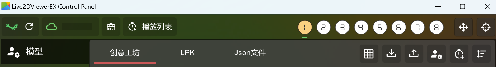

# Live2DViewerEX兼容模式使用指南

虽然v3.0.0起默认推荐使用Kage模式，但仍保留对原有Live2DViewerEX(ExAPI)的兼容支持。

## 1. 启用步骤
1. 启动Live2DViewerEX并确保其ExAPI功能已开启
2. 打开Petto设置→桌宠模式选择`Live2DViewerEX`
3. 填写相关配置(详见下方说明)
4. 保存设置退出对话框

## 2. 详细配置说明

### ExAPI地址

> 如果没有特殊情况，保持默认值即可。

必填项目，用于与Live2DViewerEX进行通信。

默认地址：`ws://127.0.0.1:10086/api`

### Live2D模型序号

必填项目，用于指定Petto使用的Live2D模型序号。其值为(Live2DViewerEX中显示的模型编号-1)。例如，在下图的情况下选择的模型，其序号为0。



### 动作分组

设置角色动作分组。角色在每次触发任务时也会自动触发动作。

填写"动作分组"字段(英文逗号分隔)以便Petto在触发任务(如定时问候、语音回应)时调用。例如：
```
Tap,TapHead,Idle
```

**如何查看可用动作分组：**

在Live2DViewerEX中，选中你使用的模型，点击右上角自定义按钮，可以看到一系列动作分组。

## 3. v3.0.0迁移注意事项

### 预执行脚本已废弃
**重要**：v3重构后不再自动执行旧PowerShell启动脚本(startmodel.ps1, startserver.ps1)。

如果之前使用了本地模型脚本，需要手动运行这些服务并在设置中填写接口地址。

关于本地模型部署的详细信息，请查看[CHANGELOG_v3.0.0.md](../CHANGELOG_v3.0.0.md)。

### 窗口标题功能已废弃
**重要**：v3.0.0已移除"窗口标题"作为上下文的配置选项。

现在统一使用窗口截图功能获取上下文信息(详见README中的"窗口截图"设置说明)。

## 4. 故障排查

| 问题 | 可能原因 | 解决办法 |
| ---- | -------- | -------- |
| 无动作触发 | 动作分组留空 | 在动作分组中添加Live2DViewerEX里存在的分组名 |
| 文本未显示 | ExAPI未开启/地址错误 | 检查Live2DViewerEX设置的端口与开关 |
| 模型序号不对 | 记错编号 | 在Live2DViewerEX模型列表确认编号并-1填写 |
| 不定时断开 | Live2DViewerEX重启或端口被占用 | 重新连接或修改端口 |

---
仍在使用此模式？欢迎在Issue中反馈你还需要的兼容能力，以便后续继续维护。
